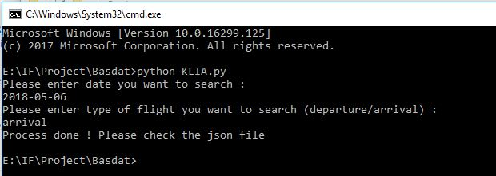
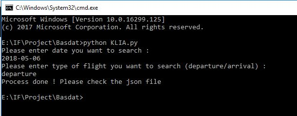

<h1 align="center">
  <br>
  Tugas 1 Seleksi Warga Basdat 2018
  <br>
  <br>
</h1>

<h2 align="center">
  <br>
  Data Scraping
  <br>
  <br>
</h2>

###Author
Mathias Novianto

### Specifications

1. Melakukan data scraping dari sebuah laman web untuk memeroleh data atau informasi tertentu __TANPA MENGGUNAKAN API__

2. Repository ini merupakan fork dari https://github.com/wargabasdat/Seleksi-2018/tree/master/Tugas1.

3. Makefile tersedia untuk clean dan run
``` Makefile
all: clean build run

clean: # remove data and binary folder

run: # run your binary

```

4. JSON telah dinormalisasi dan telah di-_preprocessing_
```
Preprocessing contohnya :
- Cleaning
- Parsing
- Transformation
- dan lainnya
```

5. Tersedia README di file README.md ini. README memuat konten :
```
- Description
- Specification
- How to use
- JSON Structure
- Screenshot program (di-upload pada folder screenshots, di-upload file image nya, dan ditampilkan di dalam README)
- Reference (Library used, etc)
- Author
```

###How to use
	1. Pastikan telah terinstall Python3 dan telah terdapat library BeautifulSoup dan urllib
	2. Jalankan make run
	3. Masukkan input tanggal dan tipe perjalanan (departure/arrival)

###JSON Structure
Arrival :
	- from	: tempat keberangkatan
	- to	: tempat tujuan
	- code	: kode penerbangan
	- status : status penerbangan
	- sta	: scheduled time of arrivals
	- eta	: estimated time of arrivals
Departure :
	- from	: tempat keberangkatan
	- to	: tempat tujuan
	- code	: kode penerbangan
	- status : status penerbangan
	- std	: scheduled time of departure
	- etd	: estimated time of departure
	- gate	: gerbang keberangkatan
	- checkin : loket check in
	
###Screenshot



###Reference
- python urllib
- python Beautifulsoup

<h1 align="center">
  <br>
  Selamat BerEksplorasi!
  <br>
  <br>
</h1>

<p align="center">
  <br>
  Basdat Industries - Lab Basdat 2018
  <br>
  <br>
</p>
